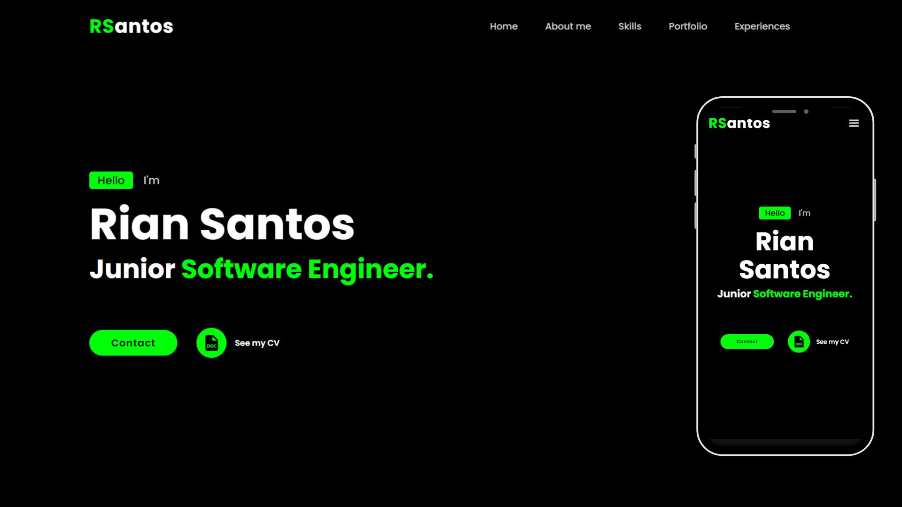
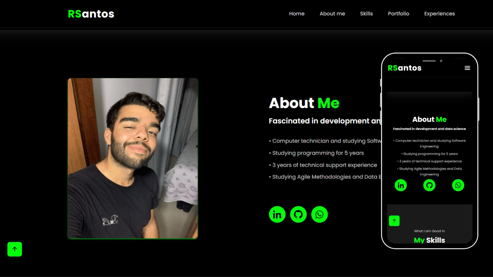
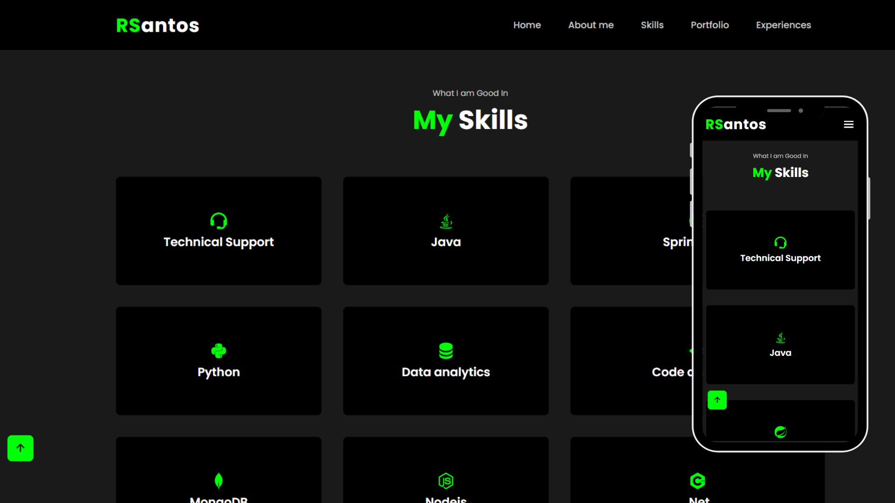
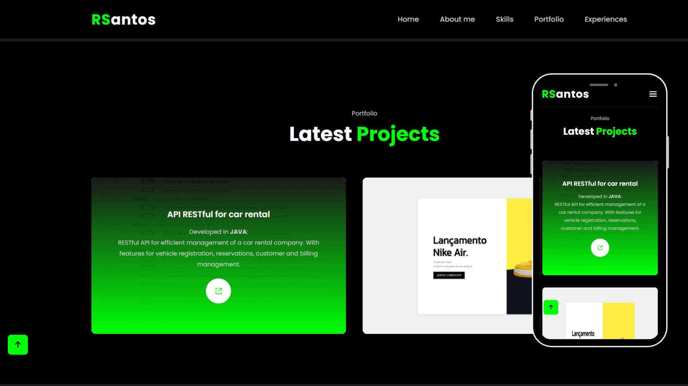

# Sales System
 

# About project

Portfólio web V2 - developed with the aim of presenting my technical skills and winning clients/jobs.

## Layout web

### Home

### About me

### Skils

### Portfolio

### Experiences

# Technologies 
- HTML
- CSS
- JavaScript

# Author

Rian Carlo Santana dos Santos

- Github: [@howisrian](https://www.github.com/howisrian)
- Linkedin: [Rian Santos](https://www.linkedin.com/in/santos-rian/)
